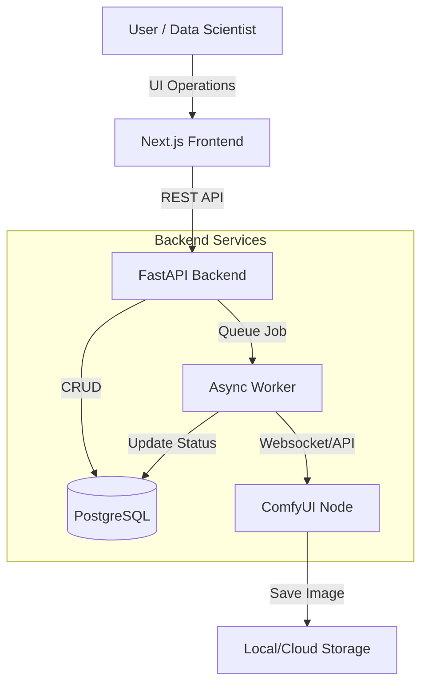

# MayaGen: Enterprise Synthetic Image Data Platform


**MayaGen** is a scalable, full-stack platform designed for generating high-quality synthetic image datasets for Machine Learning and Computer Vision applications. Built on top of **Stable Diffusion** (via ComfyUI), it automates the prompt engineering and bulk generation process, enabling researchers to create diverse, labeled datasets with ease.

---

## 🚀 Key Features

*   **🏭 Bulk Generation Pipeline**: Orchestrate large-scale image generation jobs (1000+ images) with customizable batch sizes and concurrency control.
*   **🎨 Dynamic Prompt Engineering**: Template-based prompt construction system that automatically injects variations (lighting, camera angles, styles, colors) to ensure dataset diversity.
*   **📂 Structured Asset Management**: 
    *   **Global Gallery**: Public showcase of community-generated assets.
    *   **My Collections**: Private, secure workspace for managing user-specific datasets.
    *   **Smart Filtering**: Organize by category, model type, and processing status.
*   **⚡ Modern Event-Driven Architecture**: Non-blocking asynchronous job queue (Producer/Consumer model) ensuring reliable generation even under heavy loads.
*   **🔌 Model Agnostic**: Supports standard checkpoints (SD1.5, SDXL) and specialized models (LCM, Flux) via extensible provider interface.
*   **🔐 Enterprise Security**: Role-Based Access Control (RBAC), JWT Authentication, and secure asset isolation.

---

## 🛠️ Technology Stack

| Component | Technology | Description |
| :--- | :--- | :--- |
| **Frontend** |   | High-performance React framework with Shadcn UI components. |
| **Backend** |   | Async Python API handling job orchestration and DB interactions. |
| **Database** |  | Robust relational storage for users, jobs, and image metadata. |
| **Inference** |  | Node-based Stable Diffusion backend for flexible workflow design. |
| **Infrastructure** |  | Containerized deployment for consistent environments. |

---

## 🏗️ Architecture Overview



---

## ⚡ Getting Started

### Prerequisites

*   **Python 3.10+** (with `uv` package manager recommended)
*   **Node.js 18+** & **npm**
*   **Docker** & **Docker Compose** (optional, for full stack)
*   **ComfyUI** instance (running locally or remotely)

### 1. Backend Setup

```bash
cd mayagen-be

# Create virtual environment & install dependencies
uv venv
source .venv/bin/activate
uv pip install -r pyproject.toml

# Configuration
cp .env.example .env.development
# Edit .env.development with your ComfyUI URL and DB credentials

# Run Server (Development)
uv run run_server.py
```

### 2. Frontend Setup

```bash
cd mayagen-fe

# Install dependencies
npm install

# Run Development Server
npm run dev
```

The application will be available at `http://localhost:3000`.

---

## 📖 Usage Guide

### Creating a Bulk Dataset
1.  Navigate to **Bulk Generate** in the sidebar.
2.  Define your **Base Prompt** (e.g., "A futuristic cyberpunk city").
3.  Select **Variations**:
    *   *Lighting*: Neon, Daylight, Foggy
    *   *Style*: Realistic, Anime, Oil Painting
4.  Set **Batch Size** (e.g., 50 images).
5.  Click **Queue Batch**. The system will generate unique permutations of your prompt and begin processing.

### Exporting Data
Generated images are stored in `mayagen-be/synthetic_dataset/{Category}/`. Metadata is available via the `GET /api/images` endpoint for easy integration with training pipelines.

---

## 🤝 Contribution

Contributions are welcome! Please verify that your changes pass the linting checks and include tests for any new API endpoints.

1.  Fork the repository.
2.  Create a feature branch (`git checkout -b feature/amazing-feature`).
3.  Commit your changes (`git commit -m 'Add amazing feature'`).
4.  Push to the branch (`git push origin feature/amazing-feature`).
5.  Open a Pull Request.

---

## 📄 License

Distributed under the MIT License. See `LICENSE` for more information.
